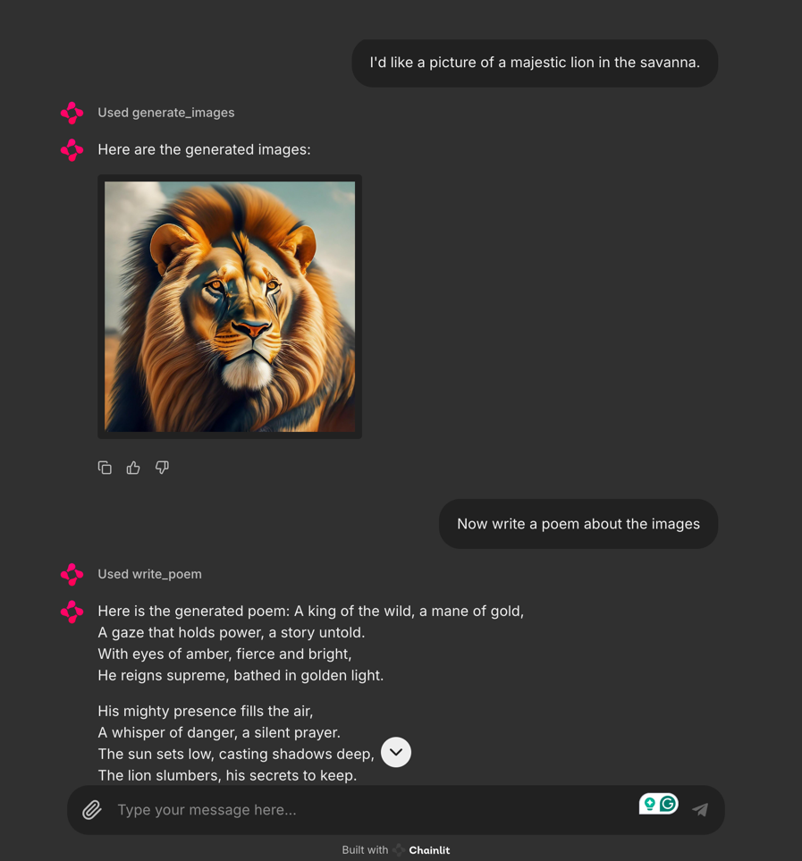

# Picasso: A Multimodal Chat Demo that integrates Vertex AI, Gemini and Imagen 3

## Project Overview

Picasso is a multimodal chat demo that brings together the power of Vertex AI and Google's Gemini family of models for a uniquely interactive experience. By tapping into Gemini's advanced features, including function calling and the cutting-edge Imagen image generation model, Picasso can create stunning images, compose poems, and engage in natural, engaging conversations with users.

[](https://deploy.cloud.run)



**Technologies Used:**

* **Vertex AI:** Google Cloud's AI platform for building, deploying, and managing AI models.
* **Gemini:** Google's family of multimodal models, enabling text and image understanding and generation.
+ **Imagen:** A state-of-the-art image generation model from Google Research.  
* **Chainlit:** A Python framework for building chatbot UIs.

**Intended Audience:**

This demo is intended for developers, researchers, and anyone interested in exploring the potential of multimodal chatbots powered by Vertex AI and Gemini.

## Demo Features

* **Multimodal Chat:** Engage in natural conversations with the chatbot using both text and images.
* **Gemini Function Calling:**  Witness how Gemini can intelligently call predefined functions within the chat, such as generating images or writing poems based on the conversation context.
* **Image Generation:** Experience the power of Google's Image Generation API as the model generates images based on user prompts.

## Setup and Usage

1. **Prerequisites:**
   * **Google Cloud Project:** Create a Google Cloud project and enable the Vertex AI API.
   * **Billing:** Ensure that billing is enabled for your project.
   * **Service Account:** Create a service account with the necessary permissions.
   * **Create Service Account Key:** Download the service account key as a JSON file and set the `GOOGLE_APPLICATION_CREDENTIALS` environment variable to the path of this file. Alternatively, you can pass the path to the key file as an argument in the `/app/main.py` script when initializing the `PicassoChat` class. 
   
2. **Clone the Repository:**
   ```bash
   git clone https://github.com/your-username/picasso.git
   cd picasso
   ```

3. **Install Dependencies:**
   ```bash
   pip install -r requirements.txt
   ```

4. **Run the Demo:**
   ```bash
   chainlit run app.py -w
   ```

## Code Structure

```plaintext
multimodal-chat/
├── app/
│   ├── __init__.py
│   ├── picasso.py       # Core logic for interacting with the Gemini and Imagen3 models, including function definitions for image generation and poem writing.
│   └── main.py          # Chainlit application logic. It sets up the Chainlit components and handles user interactions.
├── scripts/
│   ├── setup.sh                 # Script to set up the Google Cloud project and resources for deploying the application to cloud run.
│   └── enable-service-public-access.sh # Script to enable public access to the deployed service.
├── requirements.sh             # Script to generate requirements.txt
├── run.docker.sh               # Script to build and run the Docker container.
├── run.local.sh                # Script to run the application locally using Chainlit.
└── Dockerfile                  # Dockerfile for building the application image.
```


## Example Interactions

**Text-based Interaction:**

```
User: Write a poem about a cat sitting on a windowsill.
Chatbot: (Calls the `write_poem` function)
```

**Multimodal Interaction:**

```
User: I'd like a picture of a majestic lion in the savanna.
Chatbot: (Calls the `generate_images` function)
User: Now write a poem inspired by this image.
Chatbot: (Analyzes the generated image and calls the `write_poem` function)
```

**Function Calling:**

The chatbot can be prompted to call specific functions using natural language:

* "Generate an image of..."
* "Write a poem about..."

## Future Directions

* **Enhanced Multimodality:** Integrate more diverse input and output modalities, such as audio or video.
* **Personalized Experiences:**  Develop user profiles to tailor responses and function calls based on preferences.
* **Improved Safety and Ethics:** Implement robust mechanisms to ensure responsible AI usage and mitigate potential biases.

## License

This project is licensed under the [MIT License](LICENSE).

**Remember to replace the placeholders with your actual information.** 
